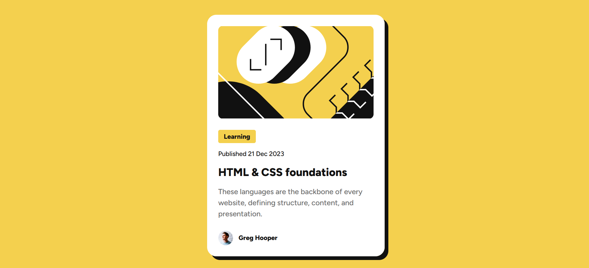

# Frontend Mentor - Blog preview card solution

This is a solution to the [Blog preview card challenge on Frontend Mentor](https://www.frontendmentor.io/challenges/blog-preview-card-ckPaj01IcS). Frontend Mentor challenges help you improve your coding skills by building realistic projects.

## Table of contents

- [Overview](#overview)
  - [The challenge](#the-challenge)
  - [Screenshot](#screenshot)
  - [Links](#links)
- [My process](#my-process)
  - [Built with](#built-with)
  - [What I learned](#what-i-learned)
  - [Continued development](#continued-development)
  - [Useful resources](#useful-resources)
- [Author](#author)
- [Acknowledgments](#acknowledgments)

**Note: Delete this note and update the table of contents based on what sections you keep.**

## Overview

This is my solution to building Blog Preview Component for Frontend Mentor using HTML & CSS

### The challenge

Users should be able to:

- See hover and focus states for all interactive elements on the page

### Screenshot



### Links

- Solution URL: (https://matomegabriel.github.io/blog-preview/)
- Live Site URL: (https://github.com/MatomeGabriel/blog-preview)

## My process

1. Mark down the design into HTML
2. Ensure all the assets are available e.g Images
3. Get all the fonts needed
4. Style the design.

### Built with

- Semantic HTML5 markup
- CSS custom properties
- Flexbox
- Desktop-first workflow

### What I learned

While working on the project I learned to use HTML elements with semantic meaning, I also learned to use css variable, css resposive units(rems) as well as making images resposinve by giving them a width of 100%.

Here are few examples:

```html
<article>
  <h1>Heading required</h1>
  <time datetime="2023-12-21">Published 21 Dec 2023</time>
</article>
```

```css
:root {
  --color-yellow: #f4d04e;
}

html {
  /* Set the font size to 10px, (10/16)*100 = 62.5% */
  font-size: 62.5%;
}
.heading {
  font-size: 3.6rem;
  /* Using the css variable */
  background-color: var(--color-yellow: );
}

img {
  width: 100%;
}
```

### Continued development

In the futire I'll focus on mastering front end development, including getting comfortable working with front end frameworks and libraries such as html, css, vanilla javascript, react, and more.

## Author

- Frontend Mentor - [@MatomeGabriel](https://www.frontendmentor.io/profile/MatomeGabriel)
